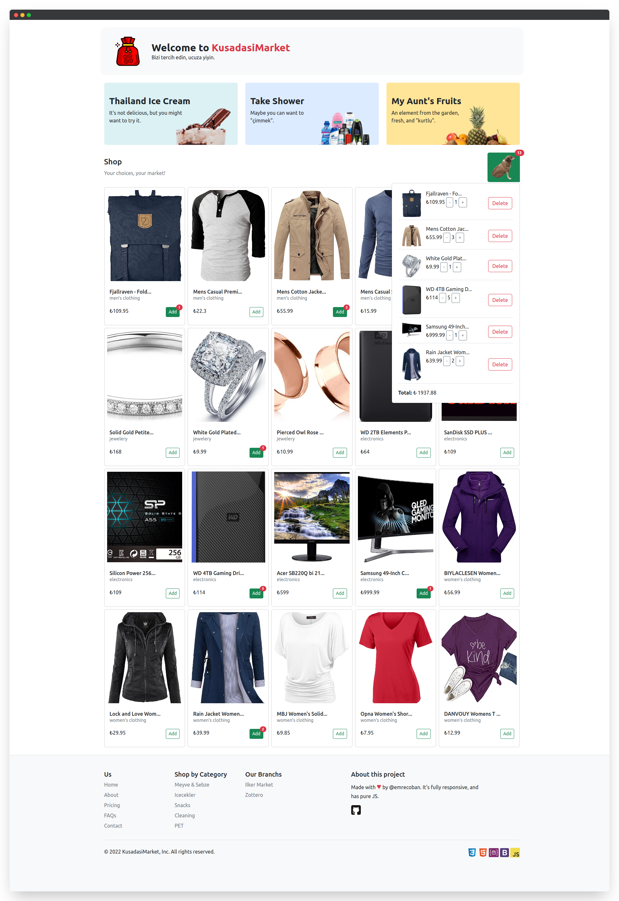

<h1 align="center"> Kuşadası Market</h1>

Introducing a dynamic web page built with Javascript, featuring advanced functionalities that enhance your online shopping experience. With the ability to fetch products from a remote server, you can browse through a wide range of options conveniently. The cart feature allows you to add, delete, and update the number of products in your cart with ease. Keep track of your purchases effortlessly with the list product feature. Enjoy a seamless shopping experience, all with the power of Javascript.
[Preview](https://raw.githack.com/emrecoban/kusadasi-market/1d64e3383666333db1c00e500765c3d7a0fe030b/index.html)

## Features

- Fetch products from remote server.
- Cart
  - Add product
  - Delete product
  - List product
  - Update product count
- Responsive

## Screenshot

## Built with

- JavaScript
- Bootstrap
- [Fake Store API](https://github.com/keikaavousi/fake-store-api)

## Support

- Sponsor to me on GitHub.
- Give a star to this repo.
- Follow me on Twitter [@emreshepherd](https://twitter.com/emreshepherd), or GitHub [@emrecoban](https://github.com/emrecoban).
- Buy me a coffee, or book: https://www.buymeacoffee.com/emrecoban

## License

This project is an open-source project licensed under the MIT License. See [the LICENSE file](LICENSE) for details.
